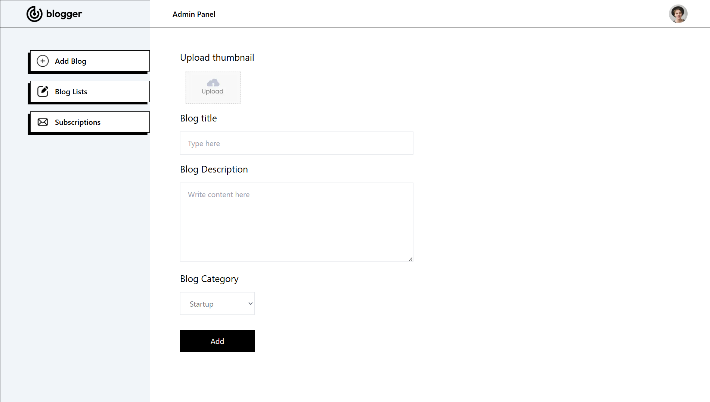
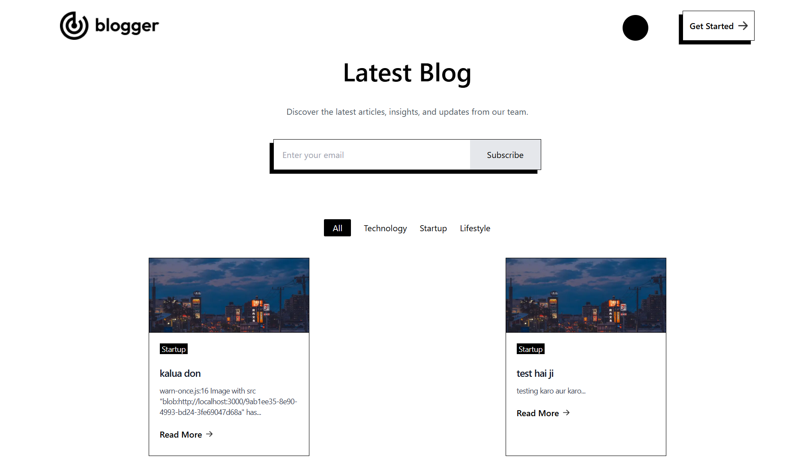
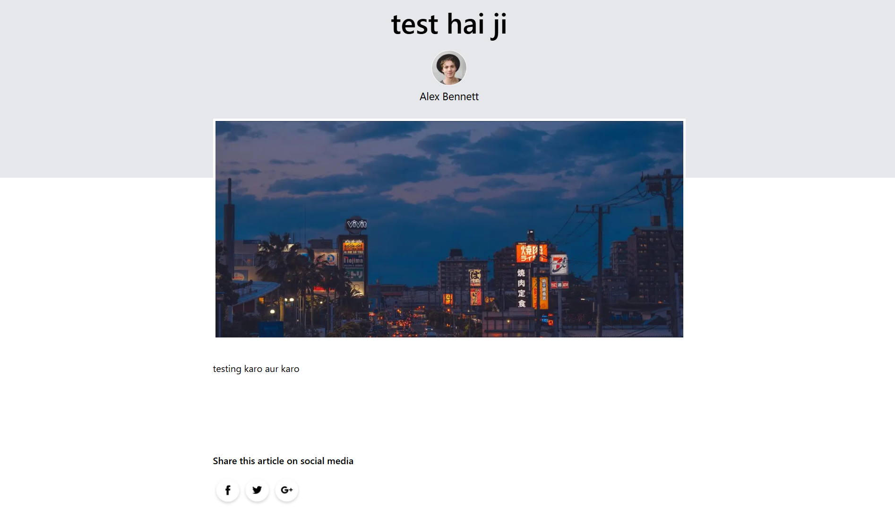

# 📝 Blogger — Blog Management App

A full-stack blogging platform built with **Next.js 14**, **MongoDB**, and **TailwindCSS**, featuring:

- User-friendly blogging interface
- Admin panel for managing blogs and email subscriptions
- Responsive design
- Email subscription form
- Login/Signup pages (frontend only — backend not implemented yet)

On this website, we have an admin panel to add blogs using different categories, see all the blogs that have been published, and also see the emails that have been subscribed to the website. Subsequently, we can remove them if we need them from the admin panel itself.

On the home page which is open to all users there, we can see all the blogs that the admin has published, also we can filter them by the category itself. We can share the blog if we want to.

---

## 🚀 Features

- Home page with latest blogs, filterable by category
- Detailed blog page with rich content & social sharing
- Email subscription form
- Admin panel:
  - Add blogs with image upload
  - List and delete blogs
  - Manage email subscriptions
- Login & Signup pages (frontend only — backend authentication not implemented yet)

---

## 🖼️ UI Screenshots

### 📌 Admin — Add Blog Post


---

### 📌 User — Home Page


---

### 📌 User — Single Blog View



---

## 🛠️ Tech Stack

- [Next.js 14](https://nextjs.org/) — App Router (`app/` directory, `use client` components)
- [MongoDB](https://www.mongodb.com/) — Database
- [Mongoose](https://mongoosejs.com/) — ODM for MongoDB
- [React Toastify](https://fkhadra.github.io/react-toastify/) — Notifications
- [Axios](https://axios-http.com/) — HTTP client
- [TailwindCSS](https://tailwindcss.com/) — Styling
- [NextAuth.js](https://next-auth.js.org/) — *(planned)* Authentication

---

---

## ⚙️ Installation & Setup

### 1️⃣ Clone the repository

```bash
git clone https://your-repo-url.git
cd blogger
```
### 2️⃣ Install dependencies
```
npm install
```
### 3️⃣ Configure environment
Create a `.env.local` file in the root directory with your MongoDB connection string:

```
MONGO_URI=your-mongodb-connection-string
```

### 4️⃣ Run development server
```
npm run dev
```
Visit `http://localhost:3000` in your browser.

---

## 🧪 Available Scripts

- `npm run dev` — Run development server

- `npm run build`— Build for production

- `npm run start` — Start production server

- `npm run lint` — Lint code

---

## ℹ️ Notes
The login and signup pages are currently frontend only, with no backend authentication logic implemented.

You can implement authentication using `NextAuth.js` or another solution as needed. (Future Scope)

## 📄 License
MIT